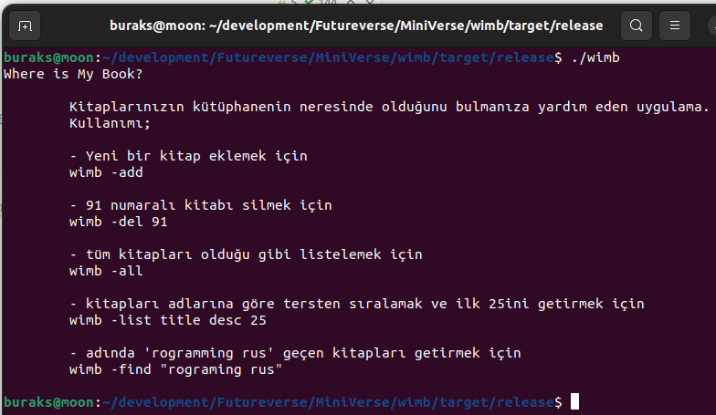
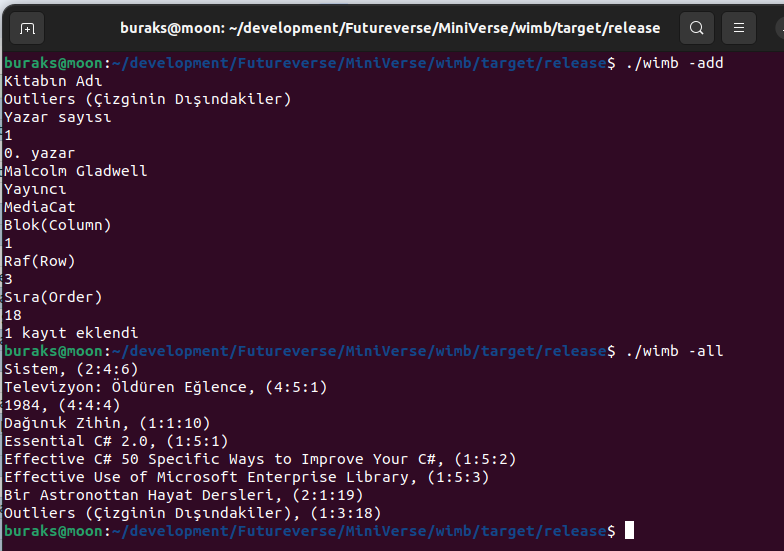
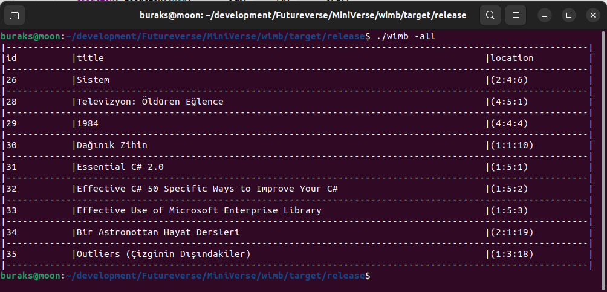
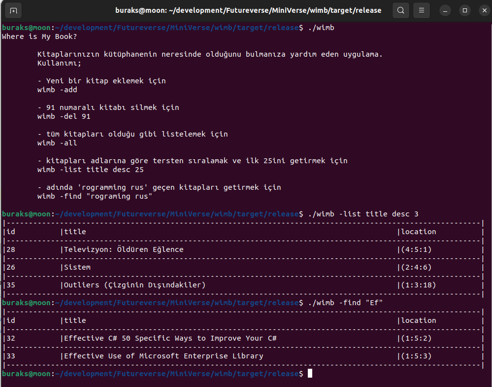

# wimb _(Where Is My Book)_

Kütüphanemde yüzden fazla kitap var ve bazen ihtiyacım olanı bulmakta zorlanıyorum. Hangi kitabın nerede olduğunu kolayca bulabileceğim bir yol arıyorum ve bunu görsellikten uzak şekilde bir terminal uygulaması üzerinden yapabilmek istiyorum.

## Ortam Bilgileri

| Kriter               | Değer                           |
|----------------------|---------------------------------|
| Operating System     | Ubuntu 22.04                    |
| Programming Language | Rust                            |
|IDE| IntelliJ IDEA Community Edition |

## Senaryo - 1

1. Temrinalde **wimb** yazılarak uygulama çalıştırılır.
2. Bir karşılama ekranı sunulur. **ASCII** sanatı uygulanabilir.
3. Ardından kulanıcıyı bir **menü** karşılar.
   1. Ekle
   2. Ara
   3. Listele
   4. Sil
4. **Ekle** seçilirse kullanıcıya şunlar sorulur.
   1. Kitabın adı
   2. Yazarı/Yazarları
   3. Yayınevi
   4. Yayın tarihi
   5. Kategorisi
   5. Sütun
   6. Raf
   7. Sıra
5. **Ara** seçilirse kitabın adı sorulur _(İçinde geçeni ara şeklinde çalışır)_
6. **Listele** seçilirse kullanıcıya sıralama kriteri sorulur ve buna göre sıralanır.
   1. Ada göre (asc/desc)
   2. Yazar adına göre (asc/desc)
   3. Yayın tarihine göre (asc/desc)
   4. Sütuna göre (Hangi sütunda hangi kitaplar var)
   5. Kategoriye göre (asc/desc)
   6. vb
7. **Sil** seçilirse kitabın id bilgisi sorulur ve silme işlemi yapılır.

## Senaryo - 2

Senaryo - 1 de yer alan menü ve adımlar komut satırından girilen argümanlarla karşılanır. Buna göre detaylı bir help dokümanı gerekir.
Örnekler;

```bash
# Yeni bir kitap eklemek için
wimb -add
# 91 numaralı kitabı silmek için
wimb -del 91
# kitapları adlarına göre tersten sıralamak ve ilk 25ini getirmek için
wimb -list name desc 25
# kitapları yayıncı adlarına göre sıralayıp ilk 10 dakini getirmek için
wimb -list publisher asc 10
# adında 'rogramming rus' geçen kitapları getirmek için
wimb -find "rograming rus"
```

## Çıktılar

Örnek çalışma zamanı çıktıları şöyle.





Listeleme görünümünün güncelleştirilmiş hali sonrası çalışma zamanı aşağıdaki gibidir.



